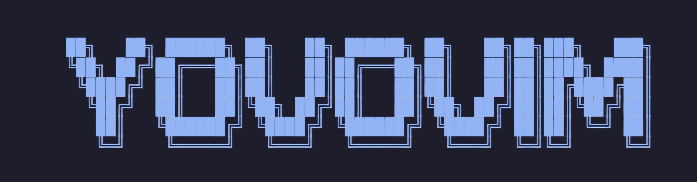
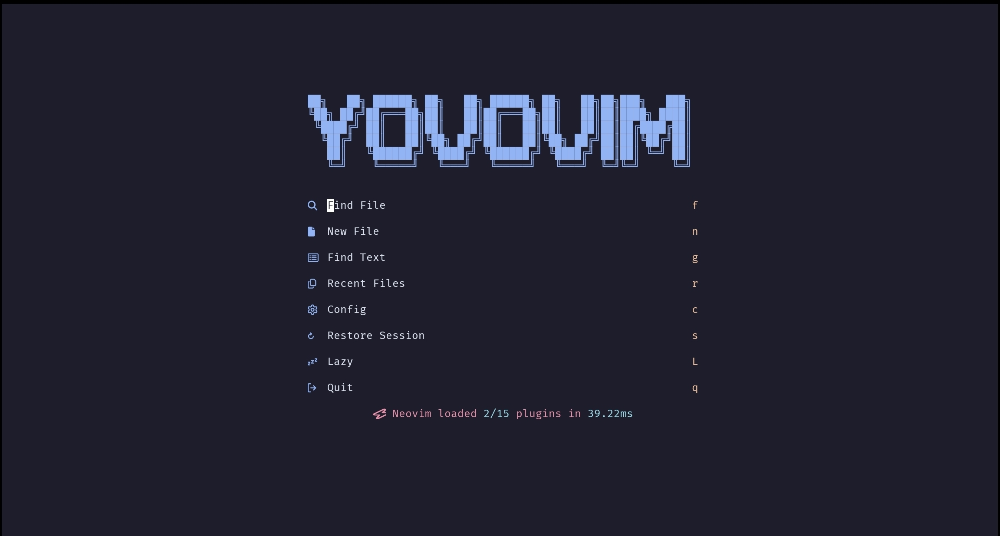

  

# YovoVim

  
  
  
  
  
  

A lightweight, modern, and blazingly fast personal Neovim configuration.

---

**YovoVim** is my personal Neovim configuration. You are completely free to use this as your own config, fork it, or borrow any part of it for your setup.

## 📸 Preview

  

## ⚡ Performance

Cold startup times:
* **~25 ms** average on computer
* **~35 ms** average on phone (Android / Termux)

---

## 📦 Plugins Used

* **[lazy.nvim](https://github.com/folke/lazy.nvim)**
* **[blink.cmp](https://github.com/saghen/blink.cmp)**
* **[nvim-lspconfig](https://github.com/neovim/nvim-lspconfig)**
* **[nvim-treesitter](https://github.com/nvim-treesitter/nvim-treesitter)**
* **[conform.nvim](https://github.com/stevearc/conform.nvim)**
* **[gitsigns.nvim](https://github.com/lewis6991/gitsigns.nvim)**
* **[nvim-ufo](https://github.com/kevinhwang91/nvim-ufo)** & **[promise-async](https://github.com/kevinhwang91/promise-async)**
* **[render-markdown.nvim](https://github.com/MeanderingProgrammer/render-markdown.nvim)**
* **[which-key.nvim](https://github.com/folke/which-key.nvim)**
* **[flash.nvim](https://github.com/folke/flash.nvim)**
* **[venv-selector.nvim](https://github.com/linux-cultist/venv-selector.nvim)**
* **[smear-cursor.nvim](https://github.com/sphamba/smear-cursor.nvim)**
* **[mini.nvim](https://github.com/echasnovski/mini.nvim)**
  * `mini.icons`
  * `mini.pairs`
  * `mini.surround`
  * `mini.ai`
* **[snacks.nvim](https://github.com/folke/snacks.nvim)**
  * `snacks.picker`
  * `snacks.explorer`
  * `snacks.dashboard`
  * `snacks.terminal`
  * `snacks.indent`
  * `snacks.dim`
  * `snacks.words`
  * `snacks.statuscolumn`
  * `snacks.bigfile`

---

## 🛠️ Custom Features

* **Bytecode Theme Engine**: Compiles highlights into binary bytecode cache (`cache.bin`) for sub-millisecond loading. Includes Catppuccin, Gruvbox, TokyoNight, Kanagawa, and Rose Pine (`<leader>th`).
* **Native Statusline**: A lightweight native statusline with zero plugin dependencies and 0.00ms startup impact.
* **Floating Code Runner**: Run the active file (Python, C, C++, Rust, Go, Bash) in a floating terminal with `<leader>cr`.

---

## ⌨️ Common Keybindings

`<leader>` is set to **`<Space>`**.

### Navigation & Files
| Keymap | Action |
| :--- | :--- |
| `;` | Enter command mode (`:`) |
| `jk` | Exit insert mode to normal mode |
| `<C-s>` | Save current file |
| `<C-n>` | Open file explorer |
| `<leader>x` | Close current buffer |
| `<S-l>` / `<S-h>` | Next / Previous open buffer |
| `<C-h/j/k/l>` | Navigate between split windows |

### Search & Pickers
| Keymap | Action |
| :--- | :--- |
| `<leader>ff` | Find files in project |
| `<leader>fg` | Search text across project (Grep) |
| `<leader>fb` | List open buffers |
| `<leader>fr` | Recent files |
| `<leader>ft` | Find TODO / FIXME / NOTE comments |
| `<leader>th` | Open color scheme switcher |

### Motion & Code Tools
| Keymap | Action |
| :--- | :--- |
| `s` / `S` | Flash 2-character jump motion |
| `<leader>cr` | Run current file in floating terminal |
| `<leader>tt` | Toggle floating terminal |
| `<leader>td` | Toggle scope focus dimming |
| `<leader>cv` | Select Python virtual environment |
| `<leader>z` | Toggle fold under cursor |
| `zR` / `zM` | Open all folds / Close all folds |
| `zP` | Peek folded lines preview |
| `gd` / `gr` | Go to definition / references |
| `<leader>rn` | Rename symbol |
| `<leader>ca` | Code actions |
| `<leader>d` | Show line error details |

---

## 🙏 Acknowledgements

* **[NvChad](https://github.com/NvChad/NvChad)** – Some components and design concepts were adapted to suit our specific requirements.

---

## 📄 License

This configuration is open source and available under the [MIT License](LICENSE).  
Copyright (c) 2026 Yash Modi.
